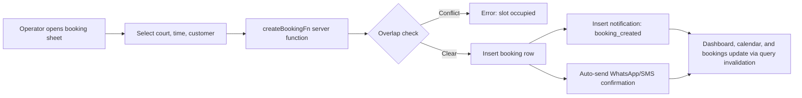
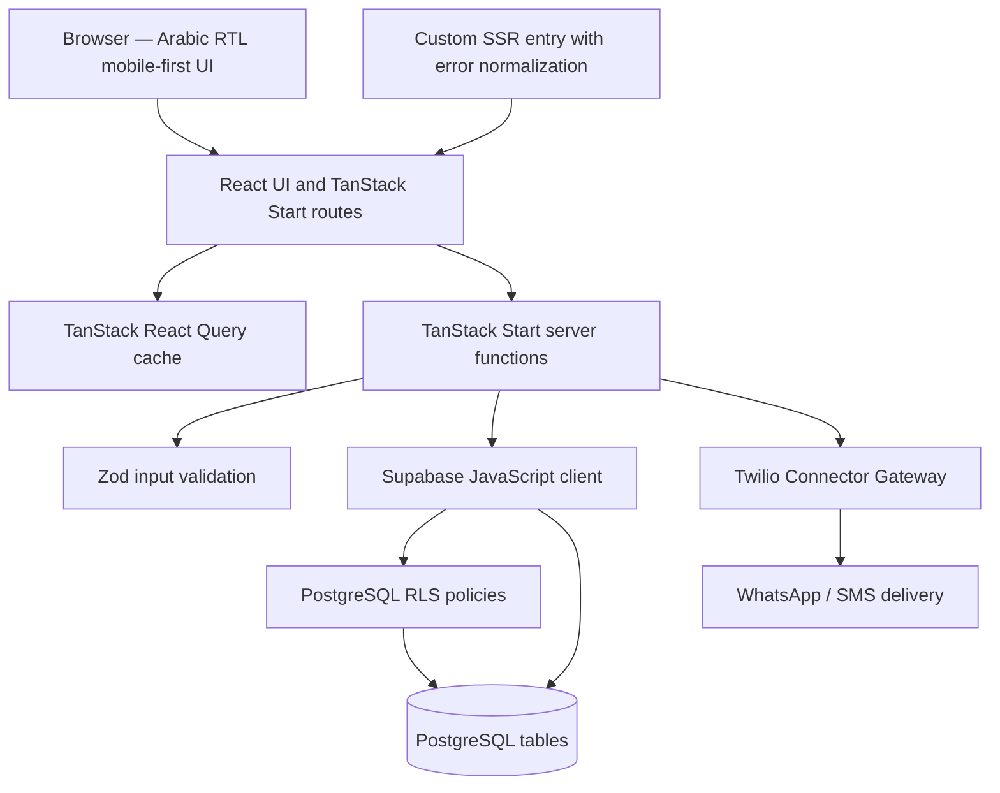
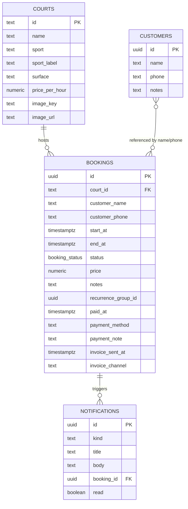

<div align="center">


# ملاعب — Court Craft Pro

**Sports Court Booking & Operations Platform**


</div>

> **Hero view — Operations dashboard**
>
> 📸 *Screenshot: Dashboard — place image at: assets/screenshots/dashboard.png*
>
> A single operational view for today's revenue, bookings, occupancy rate, live court status, and upcoming reservations.

---

## Table of Contents | فهرس المحتويات

- [Overview](#overview--نظرة-عامة)
- [Quick Start](#quick-start--بدء-سريع)
- [Quick Facts](#quick-facts--حقائق-سريعة)
- [Why This Project?](#why-this-project--لماذا-هذا-المشروع)
- [System Scope](#system-scope--نطاق-النظام)
- [Screenshots](#screenshots--لقطات-الشاشة)
- [Key Features](#key-features--الميزات-الرئيسية)
- [Module Overview](#module-overview--نظرة-عامة-على-الوحدات)
- [System Workflow](#system-workflow--سير-العمل)
- [Engineering Highlights](#engineering-highlights--نقاط-الإبداع-والتميز)
- [Technology Stack](#technology-stack)
- [Architecture Overview](#architecture-overview--نظرة-عامة-على-المعمارية)
- [Engineering Decisions](#engineering-decisions--القرارات-الهندسية)
- [Performance Considerations](#performance-considerations--اعتبارات-الأداء)
- [Technical Challenges](#technical-challenges--التحديات-التقنية)
- [UI/UX Design](#uiux-design)
- [Installation & Configuration](#installation--configuration)
- [Project Structure](#project-structure)
- [Services Provided](#services-provided)
- [API Overview](#api-overview)
- [Database Overview](#database-overview--نظرة-عامة-على-قاعدة-البيانات)
- [Security](#security--الأمان)
- [Deployment](#deployment--النشر)
- [Roadmap](#roadmap--خارطة-الطريق)
- [Development Team](#development-team)

## Overview | نظرة عامة

🇺🇸 **English**

Court Craft Pro (ملاعب) is an operational system for managing sports court bookings, customers, invoicing, and financial oversight. It handles court scheduling, time-slot conflict detection, payment tracking, customer records, recurring reservations, and automated WhatsApp/SMS confirmations from a single mobile-first Arabic interface. The system targets court facility operators — branch managers, receptionists, and owners — who need real-time visibility into occupancy, revenue, and daily operations.

🇸🇦 **العربية**

ملاعب هو نظام تشغيلي لإدارة حجوزات الملاعب الرياضية والعملاء والفواتير والرقابة المالية. يتولى جدولة الملاعب واكتشاف تعارض الفترات الزمنية وتتبع المدفوعات وسجلات العملاء والحجوزات المتكررة وتأكيدات واتساب/SMS التلقائية من واجهة عربية واحدة مصممة للجوال أولاً. يستهدف النظام مشغلي المنشآت الرياضية — مديري الفروع والاستقبال والملاك — الذين يحتاجون رؤية لحظية للإشغال والإيرادات والعمليات اليومية.

## Quick Start | بدء سريع

🇺🇸 **English**

The repository uses npm scripts and requires a Supabase project configuration before the application can connect to its data layer.

🇸🇦 **العربية**

يستخدم المستودع أوامر npm ويتطلب إعداد مشروع Supabase قبل أن يتمكن التطبيق من الاتصال بطبقة البيانات.

```bash
git clone https://github.com/mosaa65/court-craft-pro-39.git
cd court-craft-pro-39
npm install
# Configure `.env` as described below before starting the application.
npm run dev
```

Configure the required environment variables before starting the development server; the detailed configuration is documented in [Installation & Configuration](#installation--configuration).

## Quick Facts | حقائق سريعة

| Item | Value |
| --- | --- |
| Project type | Web-based sports court booking and operations management system |
| Architecture | Modular TanStack Start application with Supabase-backed PostgreSQL and server functions |
| Frontend | React 19, TypeScript, TanStack Start, TanStack Router, Tailwind CSS v4 |
| Backend | TanStack Start server functions (createServerFn), Supabase data API, Twilio messaging gateway |
| Database | PostgreSQL via Supabase |
| Deployment | [Vercel — live preview](https://court-craft-pro-39.vercel.app) |
| License | Not specified in the repository |

---

## Why This Project? | لماذا هذا المشروع؟

🇺🇸 **English**

Sports court operations involve tightly coupled workflows: a booking affects court availability, customer records, invoice generation, payment status, and daily revenue reporting. Manual scheduling with notebooks or spreadsheets leads to double-bookings, lost revenue from unpaid sessions, and no visibility into occupancy patterns. Court Craft Pro puts these workflows into a single real-time system with conflict-aware scheduling, automatic customer notifications via WhatsApp and SMS, integrated invoicing with payment tracking, and daily KPI dashboards — purpose-built for the Saudi and Yemeni sports facility market with full Arabic RTL support.

🇸🇦 **العربية**

تتضمن عمليات الملاعب الرياضية مسارات عمل مترابطة: الحجز يؤثر في توفر الملعب وسجلات العملاء وإنشاء الفواتير وحالة الدفع وتقارير الإيرادات اليومية. الجدولة اليدوية بالدفاتر أو جداول البيانات تؤدي إلى حجوزات مزدوجة وفقدان إيرادات من جلسات غير مدفوعة وغياب الرؤية لأنماط الإشغال. يجمع ملاعب هذه المسارات في نظام واحد لحظي مع جدولة واعية بالتعارض وإشعارات تلقائية للعملاء عبر واتساب وSMS وفوترة متكاملة مع تتبع المدفوعات ولوحات مؤشرات أداء يومية — مصمم خصيصاً لسوق المنشآت الرياضية السعودي واليمني مع دعم كامل للعربية وRTL.

## System Scope | نطاق النظام

🇺🇸 **English**

- **Scheduling:** court booking, hourly calendar view, time-slot conflict detection, recurring weekly reservations, and booking status lifecycle (confirmed, pending, training, maintenance, cancelled).
- **Courts:** multi-sport court management (padel, football, tennis, basketball), pricing per hour, surface type, custom court images via Supabase Storage, and live availability status.
- **Customer relationships:** customer registry with name, phone, and notes; search; quick-pick during booking creation; customer booking history.
- **Finance and invoicing:** revenue dashboards, invoice generation per booking, payment tracking (cash/transfer/card), paid/unpaid filtering, CSV export, and invoice delivery via WhatsApp or SMS.
- **Notifications:** automated booking confirmation, cancellation, payment received, and invoice sent/overdue alerts; notification center with read/unread status and bulk mark-as-read.
- **Administration:** branch info panel, staff/roles overview, system settings (currency, language, working hours), and support/help panel.

🇸🇦 **العربية**

- **الجدولة:** حجز الملاعب وعرض التقويم بالساعة واكتشاف تعارض الفترات والحجوزات الأسبوعية المتكررة ودورة حالة الحجز (مؤكد، بانتظار الدفع، تدريب، صيانة، ملغى).
- **الملاعب:** إدارة ملاعب متعددة الرياضات (بادل، قدم، تنس، سلة)، التسعير بالساعة، نوع الأرضية، صور مخصصة عبر Supabase Storage، وحالة التوفر المباشرة.
- **العلاقات مع العملاء:** سجل عملاء بالاسم والهاتف والملاحظات؛ البحث؛ الاختيار السريع أثناء إنشاء الحجز؛ سجل حجوزات العميل.
- **المالية والفوترة:** لوحات الإيرادات وإنشاء فاتورة لكل حجز وتتبع المدفوعات (نقد/تحويل/بطاقة) والتصفية حسب حالة الدفع وتصدير CSV وإرسال الفواتير عبر واتساب أو SMS.
- **الإشعارات:** تأكيد الحجز التلقائي والإلغاء واستلام الدفع وتنبيهات إرسال/تأخر الفاتورة؛ مركز إشعارات مع حالة مقروء/غير مقروء وتعليم الكل كمقروء.
- **الإدارة:** لوحة معلومات الفرع ونظرة على الموظفين والأدوار وإعدادات النظام (العملة، اللغة، ساعات العمل) ولوحة الدعم والمساعدة.

---

## Screenshots | لقطات الشاشة

🇺🇸 **English**

No screenshots directory is present in the repository. The following placeholders indicate the screens available in the application.

🇸🇦 **العربية**

لا يوجد مجلد لقطات شاشة في المستودع. تشير العناصر التالية إلى الشاشات المتوفرة في التطبيق.

### Dashboard | لوحة التحكم

📸 *Screenshot: Dashboard with KPI cards, live court status carousel, and upcoming bookings — place image at: assets/screenshots/dashboard.png*

### Bookings | الحجوزات

| Bookings list | Booking detail |
| --- | --- |
| 📸 *Screenshot: Bookings list with date navigation, search, status and duration filters — place image at: assets/screenshots/bookings.png* | 📸 *Screenshot: Booking detail with court hero, payment card, edit and cancel actions — place image at: assets/screenshots/booking-detail.png* |

### Calendar | التقويم

📸 *Screenshot: Hourly calendar view with court tabs, booking slots, and availability legend — place image at: assets/screenshots/calendar.png*

### Courts | الملاعب

| Courts list | Court detail |
| --- | --- |
| 📸 *Screenshot: Courts list with hero images, availability, bookings count, and pricing — place image at: assets/screenshots/courts.png* | 📸 *Screenshot: Court detail with schedule, edit, and delete actions — place image at: assets/screenshots/court-detail.png* |

### Finance | المالية

📸 *Screenshot: Finance dashboard with collected/pending revenue KPIs, invoice list, invoice drawer, and CSV export — place image at: assets/screenshots/finance.png*

### Customers | العملاء

📸 *Screenshot: Customer list with search, customer detail with booking history — place image at: assets/screenshots/customers.png*

### Notifications | الإشعارات

📸 *Screenshot: Notification center with booking, payment, and invoice alerts — place image at: assets/screenshots/notifications.png*

### Administration | الإدارة

📸 *Screenshot: Management hub with courts, customers, finance, and settings navigation — place image at: assets/screenshots/manage.png*

---

## Key Features | الميزات الرئيسية

🇺🇸 **English**

- 🏟️ **Conflict-aware scheduling:** booking creation validates against existing reservations for the same court and time window, preventing double-bookings at the database query level.
- 🔁 **Recurring reservations:** weekly bookings for 2–52 weeks with pre-flight conflict checking across all occurrences before any are inserted.
- 📱 **Mobile-first Arabic interface:** RTL layout, Arabic date/time formatting, Arabic digit conversion, and a floating bottom navigation bar designed for 440px-max mobile screens.
- 💳 **Payment lifecycle tracking:** mark bookings as paid (cash, transfer, card) or unpaid; filter invoices by payment status; track collected vs. pending revenue with date-range KPI cards.
- 📤 **WhatsApp and SMS confirmations:** automated booking confirmation messages via Twilio (WhatsApp first, SMS fallback); on-demand invoice delivery to customer phone numbers.
- 📊 **Operational dashboard:** today's revenue, booking count, occupancy rate, active courts, live court status carousel, upcoming bookings list, and weekly performance summary.
- 🗓️ **Visual hourly calendar:** day-by-day court schedule with hour-level granularity, court tabs, status-colored booking slots, and direct navigation to booking details.
- 🧾 **Invoice management:** auto-generated invoice numbers, invoice drawer with full booking details, payment method, and CSV export of filtered invoice data.
- 👥 **Customer registry:** dedicated customer database with phone uniqueness constraint, search by name or phone, quick-pick during booking, and customer profile with booking history.
- 🔔 **Notification center:** automated alerts for booking creation, cancellation, payment receipt, and invoice delivery; mark-as-read, bulk mark-all, and delete actions.

🇸🇦 **العربية**

- 🏟️ **جدولة واعية بالتعارض:** يتحقق إنشاء الحجز من الحجوزات الموجودة لنفس الملعب والفترة الزمنية، مما يمنع الحجوزات المزدوجة على مستوى استعلام قاعدة البيانات.
- 🔁 **حجوزات متكررة:** حجوزات أسبوعية لمدة ٢–٥٢ أسبوعاً مع فحص تعارض مسبق لجميع الحالات قبل إدخال أي منها.
- 📱 **واجهة عربية بأولوية الجوال:** تخطيط RTL وتنسيق التاريخ والوقت بالعربية وتحويل الأرقام العربية وشريط تنقل سفلي عائم مصمم لشاشات بعرض ٤٤٠ بكسل كحد أقصى.
- 💳 **تتبع دورة المدفوعات:** تعليم الحجوزات كمدفوعة (نقد، تحويل، بطاقة) أو غير مدفوعة؛ تصفية الفواتير حسب حالة الدفع؛ تتبع الإيرادات المحصلة مقابل المعلقة مع بطاقات مؤشرات بنطاق تاريخي.
- 📤 **تأكيدات واتساب وSMS:** رسائل تأكيد حجز تلقائية عبر Twilio (واتساب أولاً، SMS احتياطي)؛ إرسال فواتير عند الطلب لأرقام هواتف العملاء.
- 📊 **لوحة تحكم تشغيلية:** إيراد اليوم وعدد الحجوزات ونسبة الإشغال والملاعب النشطة وشريط حالة الملاعب المباشر وقائمة الحجوزات القادمة وملخص أداء الأسبوع.
- 🗓️ **تقويم بصري بالساعة:** جدول الملعب يوماً بيوم بدقة مستوى الساعة مع تبويبات الملاعب وخانات الحجز الملونة حسب الحالة والتنقل المباشر لتفاصيل الحجز.
- 🧾 **إدارة الفواتير:** أرقام فواتير تلقائية ودرج فاتورة بتفاصيل الحجز الكاملة وطريقة الدفع وتصدير CSV لبيانات الفواتير المصفاة.
- 👥 **سجل العملاء:** قاعدة بيانات عملاء مخصصة مع قيد تفرد رقم الهاتف والبحث بالاسم أو الهاتف والاختيار السريع أثناء الحجز وملف العميل مع سجل الحجوزات.
- 🔔 **مركز الإشعارات:** تنبيهات تلقائية لإنشاء الحجز والإلغاء واستلام الدفع وإرسال الفاتورة؛ تعليم كمقروء وتعليم الكل وحذف.

## Module Overview | نظرة عامة على الوحدات

🇺🇸 **English**

The modules below are organized around operational responsibilities rather than navigation labels.

🇸🇦 **العربية**

تُنظَّم الوحدات التالية وفق مسؤولياتها التشغيلية، وليس وفق تسميات التنقل فقط.

| Module | Purpose | Responsibilities and Main Capabilities |
| --- | --- | --- |
| Dashboard | Provide a current operational view. | Aggregates today's revenue, booking count, occupancy rate, active courts, live court status with next-booking preview, upcoming bookings, and weekly performance summary. |
| Bookings and Scheduling | Process court reservations. | Creates, edits, and cancels bookings; validates time-slot conflicts; supports multi-week recurring reservations; filters by date, status, court, and duration; customer search. |
| Calendar | Visualize court schedules. | Displays hourly slots per court per day, shows booking status with color coding, supports day navigation and court tab switching. |
| Courts | Maintain court data. | Manages court records (name, sport, surface, price per hour, image); supports custom image upload to Supabase Storage; shows live availability and today's booking count. |
| Customers | Manage customer relationships. | Stores customer contact data; enforces phone uniqueness; supports search, creation, editing, and deletion; enables quick-pick during booking creation. |
| Finance and Invoicing | Track revenue and generate invoices. | Displays collected and pending revenue KPIs; generates per-booking invoice records; filters by date range and payment status; renders invoice drawer with full details; exports CSV. |
| Payments and Messaging | Handle payment recording and customer communication. | Marks bookings as paid/unpaid with payment method and note; sends booking confirmations and invoices via WhatsApp or SMS through Twilio gateway. |
| Notifications | Surface operational alerts. | Receives booking-created, booking-cancelled, payment-received, invoice-sent, and invoice-overdue events; supports read/unread status, bulk mark-all, and deletion. |
| Administration | Configure system and branch settings. | Displays branch info, staff/roles overview, system settings (currency, language, time format), payment configuration, and support/help panel. |

## System Workflow | سير العمل

🇺🇸 **English**

The booking workflow below is implemented by the `createBookingFn` TanStack Start server function. It validates conflicts, persists the booking, auto-creates a notification, and attempts customer messaging.

🇸🇦 **العربية**

ينفذ سير الحجز التالي عبر دالة الخادم `createBookingFn` في TanStack Start. يتحقق من التعارض ويحفظ الحجز وينشئ إشعاراً تلقائياً ويحاول إرسال رسالة للعميل.



---

## Engineering Highlights | نقاط الإبداع والتميز

🇺🇸 **English**

- Server-side conflict detection: both single and recurring bookings validate overlap against existing reservations on the same court before insertion. Recurring bookings pre-check all weeks (up to 52) atomically — if any week conflicts, zero bookings are created.
- WhatsApp-first, SMS-fallback messaging: the Twilio integration attempts WhatsApp delivery first; on failure, it falls back to SMS automatically, providing dual-channel customer reach without operator intervention.
- Hydration-safe time rendering: the dashboard avoids SSR/client time mismatch by initializing the current time to `null` on the server and hydrating it only on the client via `useEffect`, preventing React hydration errors in time-sensitive displays.
- Custom SSR error normalization: a server entry wrapper intercepts h3/Nitro swallowed 500 errors (which return `{"unhandled":true,"message":"HTTPError"}`) and replaces them with a controlled HTML error page, preventing users from seeing raw JSON error responses.
- OKLCH-based design system: the entire color system uses OKLCH color values with custom CSS properties, providing perceptually uniform color transitions across light and dark themes with sport-specific brand tokens (pitch green, ink slate, warn amber).

🇸🇦 **العربية**

- اكتشاف التعارض على الخادم: تتحقق الحجوزات الفردية والمتكررة من التداخل مع الحجوزات الموجودة على نفس الملعب قبل الإدخال. تفحص الحجوزات المتكررة جميع الأسابيع (حتى ٥٢) بشكل ذري — إذا تعارض أي أسبوع، لا يُنشأ أي حجز.
- واتساب أولاً مع احتياطي SMS: يحاول تكامل Twilio الإرسال عبر واتساب أولاً؛ وعند الفشل ينتقل تلقائياً إلى SMS، مما يوفر وصولاً للعميل عبر قناتين دون تدخل المشغل.
- عرض الوقت الآمن من الترطيب: تتجنب لوحة التحكم عدم تطابق الوقت بين SSR والعميل بتهيئة الوقت الحالي بـ `null` على الخادم وترطيبه فقط على العميل عبر `useEffect`، مما يمنع أخطاء ترطيب React في العروض الحساسة للوقت.
- تطبيع أخطاء SSR المخصص: يعترض غلاف مدخل الخادم أخطاء 500 المبتلعة من h3/Nitro ويستبدلها بصفحة خطأ HTML مضبوطة، مما يمنع المستخدمين من رؤية استجابات JSON خام.
- نظام تصميم قائم على OKLCH: يستخدم نظام الألوان بالكامل قيم OKLCH مع خصائص CSS مخصصة، مما يوفر انتقالات لونية موحدة إدراكياً عبر السمات الفاتحة والداكنة مع رموز علامة تجارية رياضية (أخضر الملعب، رمادي الحبر، كهرمان التحذير).

## Technology Stack

| Category | Technology | Version / Evidence |
| --- | --- | --- |
| Programming Languages | TypeScript | ^5.8.3 |

### Frontend and UI

| Category | Technology | Version / Evidence |
| --- | --- | --- |
| Frontend | React | ^19.2.0 |
| Frontend | TanStack Start and TanStack Router | ^1.168.26 / ^1.170.16 |
| UI Components | Tailwind CSS v4, shadcn/ui New York configuration, and Radix UI | Tailwind ^4.2.1; Radix packages are declared individually |
| Charts | Recharts | ^2.15.4 |
| Forms | React Hook Form with @hookform/resolvers | ^7.71.2 / ^5.2.2 |
| Date | date-fns and react-day-picker | ^4.1.0 / ^9.14.0 |
| Carousel | Embla Carousel React | ^8.6.0 |
| Drawer | Vaul | ^1.1.2 |
| Command palette | cmdk | ^1.1.1 |

### Backend, Database, and Messaging

| Category | Technology | Version / Evidence |
| --- | --- | --- |
| Backend | TanStack Start server functions (createServerFn) and Nitro | ^1.168.26 / 3.0.260603-beta |
| Database | PostgreSQL through Supabase | Supabase project configuration present |
| Messaging | Twilio via Lovable Connector Gateway | WhatsApp and SMS channels; server-only integration in `twilio.server.ts` |
| Cloud | Supabase project configuration | `supabase/config.toml` and Supabase environment variables are present |
| Storage | Supabase Storage | Court images bucket with RLS policies |

### State, Validation, and Operations

| Category | Technology | Version / Evidence |
| --- | --- | --- |
| State Management | React local state and TanStack React Query | React Query ^5.101.1; queries and mutations are used in all routes |
| Validation | Zod | ^3.24.2; used for server function input validation on courts, bookings, customers, payments, notifications |
| Notifications | Sonner | ^2.0.7; toast notifications for user feedback |

### Build, Quality, and Delivery

| Category | Technology | Version / Evidence |
| --- | --- | --- |
| Build Tools | Vite | ^8.0.16 |
| Build Config | @lovable.dev/vite-tanstack-config | 2.7.6; wraps TanStack Start, React, Tailwind, Nitro, and path alias plugins |
| Testing | No automated test framework or test files found | Not documented in the repository |
| DevOps | No Dockerfile, Compose file, or CI workflow found | Not documented in the repository |
| Development Tools | ESLint, Prettier, Bun configuration | ESLint ^9.32.0 / Prettier ^3.7.3 / bunfig.toml present |

## Architecture Overview | نظرة عامة على المعمارية

🇺🇸 **English**

Court Craft Pro is a modular application, not a microservice system. File-based TanStack Start routes separate operational domains (dashboard, bookings, calendar, courts, customers, finance, notifications, administration). Reusable UI components live in `src/components`, and shared business logic — booking CRUD, payment handling, customer management, notification lifecycle, and Twilio messaging — is implemented as TanStack Start `createServerFn` server functions in `src/lib/*.functions.ts`. These server functions run on the Nitro server runtime and communicate with Supabase PostgreSQL via the typed JavaScript client.

The architecture cleanly separates client concerns (React components, TanStack Router, React Query caching) from server concerns (data validation via Zod, database operations, external messaging). The custom SSR server entry (`src/server.ts`) wraps the default TanStack Start entry to normalize catastrophic h3 errors into user-friendly HTML responses.

🇸🇦 **العربية**

ملاعب تطبيق معياري وليس نظام خدمات مصغّرة. تفصل مسارات TanStack Start المبنية على الملفات بين المجالات التشغيلية (لوحة التحكم، الحجوزات، التقويم، الملاعب، العملاء، المالية، الإشعارات، الإدارة). توجد مكونات الواجهة القابلة لإعادة الاستخدام في `src/components`، ويُنفَّذ المنطق التجاري المشترك — عمليات الحجز والمدفوعات والعملاء والإشعارات والمراسلة عبر Twilio — كدوال خادم `createServerFn` في `src/lib/*.functions.ts`. تعمل هذه الدوال على خادم Nitro وتتواصل مع Supabase PostgreSQL عبر العميل المولّد للأنواع.

تفصل المعمارية بوضوح بين اهتمامات العميل (مكونات React وTanStack Router وتخزين React Query المؤقت) واهتمامات الخادم (التحقق عبر Zod وعمليات قاعدة البيانات والمراسلة الخارجية). يغلّف مدخل خادم SSR المخصص (`src/server.ts`) المدخل الافتراضي لتطبيع أخطاء h3 الحرجة إلى استجابات HTML سهلة الاستخدام.



## Engineering Decisions | القرارات الهندسية

🇺🇸 **English**

The rationale below is inferred from the implementation, not from undocumented product decisions.

🇸🇦 **العربية**

التبرير التالي مستنتج من التنفيذ الفعلي وليس من قرارات منتج غير موثقة.

| Decision | Repository Evidence | Engineering Rationale |
| --- | --- | --- |
| TanStack Start server functions instead of REST API | All CRUD operations (`createBookingFn`, `markPaidFn`, `sendInvoiceFn`, etc.) use `createServerFn` from `@tanstack/react-start`. | Server functions provide type-safe RPC-style calls between client and server without defining separate API routes. Input validation (Zod) and business logic run server-side while staying co-located with the feature code. |
| Server-side overlap validation for bookings | `createBookingFn` and `updateBookingFn` query for overlapping bookings before insert/update. `createRecurringBookingFn` pre-checks all weeks atomically. | Overlap detection at the server guarantees consistency regardless of client behavior. Atomic all-or-nothing for recurring bookings prevents partial series creation. |
| Supabase publishable key for server functions (not service role) | `bookings.server.ts` uses `SUPABASE_PUBLISHABLE_KEY`, not `SUPABASE_SERVICE_ROLE_KEY`. | RLS policies are open (public read/write) for the MVP; the publishable key is sufficient. The admin client (`client.server.ts`) with service role key exists but is reserved for future authenticated operations. |
| WhatsApp-first with SMS fallback | `sendTwilioAuto` in `twilio.server.ts` tries WhatsApp first, then SMS. | WhatsApp has higher open rates in the Saudi/MENA market. SMS fallback ensures delivery when WhatsApp isn't available. |
| OKLCH color system with sport-brand tokens | `styles.css` defines all colors as OKLCH values with semantic tokens (`--pitch`, `--ink`, `--warn`, `--stone-line`). | OKLCH provides perceptually uniform lightness adjustments across light/dark themes, and sport-specific tokens (pitch green, ink slate) create a domain-relevant visual identity. |
| Hydration-safe time with null initial state | Dashboard uses `useState<Date | null>(null)` and `useEffect` to set `now`. | Prevents SSR/client time mismatch that would cause React hydration errors in greeting text and date displays. |

## Performance Considerations | اعتبارات الأداء

🇺🇸 **English**

The following points describe implemented behavior and its boundaries; the repository does not publish performance benchmarks.

🇸🇦 **العربية**

تصف النقاط التالية السلوك المنفذ وحدوده؛ ولا ينشر المستودع قياسات معيارية للأداء.

| Evidence | Implementation Detail | Practical Effect / Boundary |
| --- | --- | --- |
| Query management | React Query powers all data-heavy routes with `staleTime` of 5 minutes for courts and 15 seconds for bookings; mutations invalidate affected query keys. | Keeps modules synchronized after CRUD operations while reducing redundant network requests. |
| Route-level data prefetching | Route loaders call `context.queryClient.ensureQueryData` for courts, bookings, and notifications before the component renders. | Initiates data loading during route transition, avoiding blank-screen flicker for primary data. |
| Database indexes | The schema includes indexes on `bookings.start_at`, `bookings.court_id`, `bookings.status`, `bookings.recurrence_group_id`, `customers.name`, `notifications.created_at`, and `notifications.read`. | Provides indexed paths for the most common query patterns: date-range booking lookups, court-scoped queries, status filtering, and notification ordering. |
| Bounded notification reads | `listNotificationsFn` applies `.limit(60)` and orders by `created_at DESC`. | Prevents unbounded result retrieval in the notification center. |
| Lazy image loading | Court images use `loading="lazy"` on `` elements. | Defers off-screen image loading in court lists and dashboard carousels. |
| SSR boundary | A custom SSR server entry is configured with error normalization. Route loaders prefetch data server-side. | SSR error handling is explicit. The repository does not document lazy-loading policy or performance targets beyond the implemented patterns. |

## Technical Challenges | التحديات التقنية

🇺🇸 **English**

- **Time-slot conflict integrity:** bookings, recurring series, and updates must all validate against existing reservations on the same court. The server functions perform overlap queries before every insert/update, and recurring bookings pre-check all weeks atomically to avoid partial conflicts.
- **Dual-channel customer messaging:** integrating WhatsApp and SMS through Twilio requires phone number normalization (Saudi local → E.164), channel-specific sender configuration, and graceful fallback when one channel fails — all handled server-side to keep secrets out of the client bundle.
- **Arabic RTL-first design:** the entire interface is `lang="ar" dir="rtl"` from the root shell. Date/time formatting, digit conversion, navigation direction, and component alignment are all Arabic-native rather than LTR-translated, requiring custom formatting utilities throughout.
- **SSR hydration with real-time data:** displaying current time, greeting text, and live court status requires careful handling to avoid SSR/client time mismatches. The dashboard uses hydration-safe patterns with null initial state and client-side `useEffect` initialization.
- **Mobile-first constraint:** all screens are designed for a 440px max-width container with a floating bottom navigation bar, requiring horizontal scroll patterns for filter chips, court cards, and date selectors instead of traditional desktop grid layouts.

🇸🇦 **العربية**

- **سلامة تعارض الفترات الزمنية:** يجب أن تتحقق الحجوزات والسلاسل المتكررة والتحديثات من الحجوزات الموجودة على نفس الملعب. تنفذ دوال الخادم استعلامات التداخل قبل كل إدخال/تحديث، وتفحص الحجوزات المتكررة جميع الأسابيع بشكل ذري لتجنب التعارضات الجزئية.
- **مراسلة العملاء عبر قناتين:** يتطلب تكامل واتساب وSMS عبر Twilio تطبيع أرقام الهاتف (محلي سعودي ← E.164) وإعداد المرسل حسب القناة والتراجع السلس عند فشل إحدى القناتين — كل ذلك يُعالج على الخادم لإبعاد الأسرار عن حزمة العميل.
- **تصميم عربي RTL أولاً:** الواجهة بأكملها `lang="ar" dir="rtl"` من الغلاف الجذري. تنسيق التاريخ/الوقت وتحويل الأرقام واتجاه التنقل ومحاذاة المكونات كلها عربية أصلية وليست مترجمة من LTR، مما يتطلب أدوات تنسيق مخصصة في كل مكان.
- **ترطيب SSR مع البيانات اللحظية:** يتطلب عرض الوقت الحالي ونص التحية وحالة الملعب المباشرة معالجة دقيقة لتجنب عدم تطابق الوقت بين SSR والعميل. تستخدم لوحة التحكم أنماطاً آمنة مع حالة أولية null وتهيئة `useEffect` على العميل.
- **قيد أولوية الجوال:** جميع الشاشات مصممة لحاوية بعرض أقصى ٤٤٠ بكسل مع شريط تنقل سفلي عائم، مما يتطلب أنماط التمرير الأفقي لرقائق التصفية وبطاقات الملاعب ومحددات التاريخ بدلاً من تخطيطات الشبكة المكتبية التقليدية.

## UI/UX Design

| Element | Tool/Library |
| --- | --- |
| Color system | OKLCH-based CSS custom properties via Tailwind CSS v4 with sport-brand tokens (pitch, ink, warn, stone-line) and light/dark theme support |
| Typography | Plus Jakarta Sans (Latin), IBM Plex Sans Arabic (Arabic), and JetBrains Mono (monospace) |
| Design system | shadcn/ui New York configuration with Radix UI primitives |
| Icons | Lucide React |
| Charts | Recharts |
| Feedback and notifications | Sonner toast notifications |
| Layout and responsiveness | 440px max-width mobile-first container with floating bottom navigation bar, horizontal scroll chips, and drawer-based sheets |
| Direction and localization | Native Arabic RTL with `lang="ar" dir="rtl"` on root element; custom Arabic date/time formatters, Arabic digit conversion, and Arabic weekday/month names |
| Animations | Custom CSS keyframe animations (rise, slot-fill, sheet-in, fade-in) with sport-themed easing (--ease-stadium) |
| Elevation | Three-tier shadow system (elev-1, elev-2, elev-3) and pitch-glow shadow for primary actions |

## Installation & Configuration

1. Ensure Node.js and npm are available. The repository includes both `package-lock.json` and Bun configuration (`bun.lock`, `bunfig.toml`); the documented workflow uses npm.
2. Follow the [Quick Start](#quick-start--بدء-سريع) clone and install sequence.
3. Configure Supabase. No `.env.example` file is present, so the values below are derived from the environment reads in the source code.

```bash
# .env
# VITE_SUPABASE_URL=<supabase-project-url>
# VITE_SUPABASE_PUBLISHABLE_KEY=<supabase-publishable-key>
# SUPABASE_URL=<supabase-project-url>
# SUPABASE_PUBLISHABLE_KEY=<supabase-publishable-key>
# SUPABASE_SERVICE_ROLE_KEY=<server-only-key; required for admin client>
# VITE_SUPABASE_PROJECT_ID=<supabase-project-id>
# SUPABASE_PROJECT_ID=<supabase-project-id>
```

4. (Optional) Configure Twilio for WhatsApp/SMS messaging:

```bash
# LOVABLE_API_KEY=<lovable-connector-api-key>
# TWILIO_API_KEY=<twilio-api-key>
# TWILIO_FROM_SMS=<twilio-sms-phone-number>
# TWILIO_WHATSAPP_FROM=<twilio-whatsapp-phone-number>
```

5. Apply the SQL migrations in `supabase/migrations/` to the configured Supabase project. The four migrations create the courts, bookings, customers, and notifications tables with indexes, RLS policies, and triggers.

6. Run the available quality and build scripts.

```bash
npm run lint
npm run build
npm run preview
```

## Project Structure

```text
court-craft-pro-39/
├── public/
│   ├── favicon.ico
│   └── inama-soft-logo.ico
├── src/
│   ├── assets/              # Sport court images (padel, football, tennis, basket)
│   ├── components/          # Reusable UI components (app-shell, booking-sheet, etc.)
│   │   └── ui/              # shadcn/ui primitives (46 components)
│   ├── hooks/               # Custom React hooks (use-mobile)
│   ├── integrations/
│   │   └── supabase/        # Supabase clients, auth middleware, and generated types
│   ├── lib/                 # Business logic, server functions, queries, and utilities
│   ├── routes/              # TanStack Start file-based routes (17 route files)
│   ├── router.tsx
│   ├── server.ts            # Custom SSR entry with error normalization
│   ├── start.ts
│   └── styles.css           # OKLCH design system tokens and custom animations
├── supabase/
│   ├── config.toml
│   └── migrations/          # 4 SQL migrations
├── .env
├── package.json
├── tsconfig.json
└── vite.config.ts
```

## Services Provided

| Service | Value Delivered |
| --- | --- |
| Court booking operations | Gives reception staff and branch managers a conflict-aware scheduling workflow with hourly calendar, time-slot validation, and recurring reservation support. |
| Customer management | Maintains customer registry with contact data, phone uniqueness, search, and quick-pick during booking for faster repeat-customer operations. |
| Financial oversight | Consolidates revenue tracking, payment status, invoice generation, date-range filtering, and CSV export into a single finance view. |
| Customer communication | Delivers automated booking confirmations and invoices via WhatsApp and SMS, reducing manual follow-up and improving payment collection. |
| Operational visibility | Gives managers real-time KPI dashboards, occupancy rates, live court status, and weekly performance summaries for informed decision-making. |
| Notification management | Surfaces booking, payment, and invoice events as actionable alerts with read/unread tracking and bulk management. |

## API Overview

> **Integration boundary:** the repository does not define an application-owned REST or GraphQL API. The UI communicates through TanStack Start `createServerFn` server functions, which internally use the Supabase JavaScript client for database operations and the Twilio Connector Gateway for messaging.

| Area | Server Function | Responsibility |
| --- | --- | --- |
| Courts | `listCourtsFn`, `getCourtFn`, `createCourtFn`, `updateCourtFn`, `deleteCourtFn` | Full CRUD on court records with Zod-validated input. |
| Bookings | `listBookingsFn`, `getBookingFn`, `createBookingFn`, `updateBookingFn`, `cancelBookingFn`, `createRecurringBookingFn`, `cancelRecurrenceFn` | Booking lifecycle with conflict detection, recurring series management, and automatic notification creation. |
| Customers | `listCustomersFn`, `getCustomerFn`, `createCustomerFn`, `updateCustomerFn`, `deleteCustomerFn` | Customer CRUD with search and phone uniqueness enforcement. |
| Payments | `markPaidFn`, `markUnpaidFn`, `sendInvoiceFn` | Payment status recording with method and note; invoice delivery via WhatsApp or SMS. |
| Notifications | `listNotificationsFn`, `unreadCountFn`, `markNotificationReadFn`, `markAllNotificationsReadFn`, `deleteNotificationFn` | Notification retrieval, read status management, and deletion. |

## Database Overview | نظرة عامة على قاعدة البيانات

🇺🇸 **English**

The application uses PostgreSQL through Supabase. Its relational model centers on four core tables: `courts` (venue data), `bookings` (reservation records with time slots, customer info, payment tracking, recurrence links, and invoice delivery status), `customers` (contact registry with phone uniqueness), and `notifications` (event-driven alerts linked to bookings).

The schema uses a `booking_status` enum (confirmed, pending, training, maintenance, cancelled) for type-safe status management. Data integrity is protected by foreign keys (bookings → courts, notifications → bookings with CASCADE delete), a unique index on customer phone, and trigger-maintained `updated_at` fields. Performance indexes cover booking start time, court ID, status, recurrence group, customer name, and notification ordering/filtering. Supabase Storage is configured with RLS policies for the `court-images` bucket.

🇸🇦 **العربية**

يستخدم التطبيق PostgreSQL عبر Supabase. يتمحور نموذجه العلائقي حول أربعة جداول أساسية: `courts` (بيانات المكان)، و`bookings` (سجلات الحجز بالفترات الزمنية ومعلومات العميل وتتبع الدفع وروابط التكرار وحالة إرسال الفاتورة)، و`customers` (سجل جهات الاتصال بتفرد رقم الهاتف)، و`notifications` (تنبيهات مرتبطة بالحجوزات).

يستخدم المخطط تعداد `booking_status` (مؤكد، بانتظار الدفع، تدريب، صيانة، ملغى) لإدارة الحالة بأمان نوعي. تُحمى سلامة البيانات بالمفاتيح الخارجية (الحجوزات ← الملاعب، الإشعارات ← الحجوزات مع حذف متتابع) وفهرس فريد على هاتف العميل وحقول `updated_at` المُحدّثة بالمحفزات. تغطي فهارس الأداء وقت بداية الحجز ومعرف الملعب والحالة ومجموعة التكرار واسم العميل وترتيب/تصفية الإشعارات. يُضبط Supabase Storage بسياسات RLS لحاوية `court-images`.



## Security | الأمان

🇺🇸 **English**

- **Row Level Security:** RLS is enabled on all four business tables (courts, bookings, customers, notifications). Current policies permit public read/write access for the MVP phase.
- **Server-side business logic:** all data mutations (booking CRUD, payment, messaging, notifications) execute as TanStack Start server functions, keeping Zod validation, overlap detection, and Twilio secrets server-side.
- **Input validation:** Zod validates all server function inputs including court upserts, booking creation with time and status constraints, customer fields with minimum name length, payment method enums, and notification IDs.
- **Auth middleware:** a `requireSupabaseAuth` middleware is available for future use, validating Bearer JWT tokens, extracting user claims, and creating authenticated Supabase clients.
- **Admin client isolation:** the service-role Supabase client (`client.server.ts`) requires `SUPABASE_SERVICE_ROLE_KEY` and is isolated in a server-only module with lazy initialization via Proxy, ensuring it is never bundled into client code.
- **Secret isolation:** `.env` files are ignored by Git. Twilio API keys (`LOVABLE_API_KEY`, `TWILIO_API_KEY`) and sender numbers are only accessed in server-only modules (`twilio.server.ts`, `payments.functions.ts`).
- **Phone normalization:** E.164 phone number normalization prevents malformed inputs from reaching the Twilio API, with specific handling for Saudi local formats (05xxxxxxxx → +9665xxxxxxxx).

🇸🇦 **العربية**

- **أمان مستوى الصف:** يُفعَّل RLS على جميع الجداول الأربعة (الملاعب، الحجوزات، العملاء، الإشعارات). تسمح السياسات الحالية بالقراءة/الكتابة العامة في مرحلة MVP.
- **المنطق التجاري على الخادم:** تُنفَّذ جميع تعديلات البيانات (عمليات الحجز والدفع والمراسلة والإشعارات) كدوال خادم TanStack Start، مما يبقي التحقق عبر Zod واكتشاف التداخل وأسرار Twilio على الخادم.
- **التحقق من المدخلات:** يتحقق Zod من جميع مدخلات دوال الخادم بما فيها إنشاء/تحديث الملاعب والحجوزات مع قيود الوقت والحالة وحقول العملاء بحد أدنى لطول الاسم وتعدادات طرق الدفع ومعرفات الإشعارات.
- **وسيط المصادقة:** وسيط `requireSupabaseAuth` متاح للاستخدام المستقبلي، يتحقق من رموز JWT من نوع Bearer ويستخرج بيانات المستخدم وينشئ عملاء Supabase موثقين.
- **عزل العميل الإداري:** يتطلب عميل Supabase بدور الخدمة (`client.server.ts`) مفتاح `SUPABASE_SERVICE_ROLE_KEY` ويُعزل في وحدة خادم فقط مع تهيئة كسولة عبر Proxy، مما يضمن عدم تضمينه في حزمة العميل.
- **عزل الأسرار:** تُستثنى ملفات `.env` من Git. تُستخدم مفاتيح Twilio وأرقام المرسل فقط في وحدات الخادم.
- **تطبيع أرقام الهاتف:** يمنع تطبيع أرقام الهاتف بتنسيق E.164 المدخلات المشوهة من الوصول لـ Twilio API، مع معالجة خاصة للأرقام السعودية المحلية.

## Deployment | النشر

🇺🇸 **English**

The live project preview is available on [Vercel](https://court-craft-pro-39.vercel.app). To produce the deployable application bundle, configure the Supabase and Twilio environment values described in [Installation & Configuration](#installation--configuration), then run:

```bash
npm run build
```

The package also provides `npm run preview` for a local production-build check. The Vite/TanStack Start build is configured via `@lovable.dev/vite-tanstack-config` which includes Nitro with Cloudflare as the default deployment target. Hosting configuration and release automation are managed outside this repository.

🇸🇦 **العربية**

تتوفر معاينة المشروع المباشرة على [Vercel](https://court-craft-pro-39.vercel.app). لإنتاج حزمة التطبيق القابلة للنشر، اضبط قيم بيئة Supabase وTwilio الموضحة في [التثبيت والإعداد](#installation--configuration)، ثم شغّل `npm run build`. كما يوفر المشروع `npm run preview` لفحص حزمة الإنتاج محلياً. تُدار إعدادات الاستضافة وأتمتة الإصدارات خارج هذا المستودع.

**Live URL:** https://court-craft-pro-39.vercel.app

## Roadmap | خارطة الطريق

🇺🇸 **English**

The following owner-proposed priorities are intentionally separated from the implementation backlog.

- [ ] Role-based authentication with Supabase Auth (owner, manager, receptionist).
- [ ] Progressive Web App (PWA) capabilities for offline scheduling.
- [ ] Multi-branch operational support.
- [ ] Customer loyalty and subscription packages.
- [ ] Advanced analytics with revenue trends, occupancy heatmaps, and peak-hour analysis.
- [ ] Enhanced notification center with push notifications.
- [ ] Court maintenance scheduling and availability blackout periods.
- [ ] Performance tuning informed by production usage.

### Future Improvements

- [ ] Restrict RLS policies from public to role-based access.
- [ ] Containerization with Docker and Docker Compose.
- [ ] CI/CD pipeline with GitHub Actions.
- [ ] Automated testing with Vitest.

🇸🇦 **العربية**

تفصل الأولويات التالية التي اقترحها مالك المشروع عمداً عن قائمة مهام التنفيذ.

- [ ] مصادقة قائمة على الأدوار مع Supabase Auth (مالك، مدير، استقبال).
- [ ] إمكانات تطبيق الويب التقدمي (PWA) للجدولة دون اتصال.
- [ ] دعم التشغيل متعدد الفروع.
- [ ] ولاء العملاء وباقات الاشتراكات.
- [ ] تحليلات متقدمة مع اتجاهات الإيرادات وخرائط حرارة الإشغال وتحليل ساعات الذروة.
- [ ] مركز إشعارات محسن مع إشعارات الدفع.
- [ ] جدولة صيانة الملاعب وفترات حظر التوفر.
- [ ] تحسين الأداء بناءً على استخدام الإنتاج.

## Development Team

| Name | Responsibilities |
| --- | --- |
| **المهندس موسى** (Mousa Gamil Al-Awadhi) | Technical Leadership, System Architecture, Backend Engineering, Frontend Engineering, Database Design, Documentation |

---

<div align="center">


**Made with ❤️ by Inama Soft — Collaborative Development Group**

Mousa Gamil Al-Awadhi

Ibb, Yemen · [mousa.mc13@gmail.com](mailto:mousa.mc13@gmail.com) · [+967 772 217 218](tel:+967772217218)

[Website](https://inma-soft.vercel.app) · [LinkedIn](https://www.linkedin.com/in/mousa-al-awadhi-6518633a8) · [GitHub](https://github.com/mosaa65) · [Live Project](https://court-craft-pro-39.vercel.app)

تم التطوير بواسطة فريق Inama Soft © 2026

</div>
